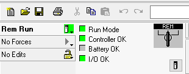
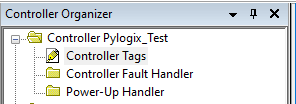

# Starter Guide

This guide makes some knowledge assumptions, experience with AB plc programs and some familiarity with python.

> Danger: As we all know PLCs control dangerous equipment so ensure you are not writing tags in live systems unless you know what you are doing, and do so at your own risk.

## Initial Setup

If you don't have python installed, download and install [Python Download](https://www.python.org/downloads/). Ensure path checkbox is checked, or set path for your system accordingly for `/Python37/Scripts`.

The best thing to do with python installed is to use pip which is a python package manager, otherwise you have to copy and paste libraries to where your script is located.

Install pylogix, ping3, and progress:

```
 pip install git+https://github.com/dmroeder/pylogix
 pip install ping3
 pip install progress
```

## RSLogix5000 Project

If you have an existing project then skip this section. You want to test this library with a very minimal code like test-01, this will ensure you have connection to the PLC before writing complex code. I am using softlogix 5800, but this applies to any Contrologix, and Compactlogix. If you already have existing code, then go to controller tags, and pick a boolean tag, and replace it on test-01.py line 25.

> Note: Ethernet Protocol does not work with emulator.

Create a new project, select your controller type, and once the project is done, add the whatever ethernet module you have in your rack, and configure the IP settings.

Save, and download program to the plc. If you can go online with the PLC, then we have good connection. If you don't check the below:



- ping plc
  - If you can't ping it, check network cables
  - Ensure your PC is on the same subnet, i.e. plc: 192.168.1.97, PC: 192.168.1.95
- Ensure project slots are the same as physical layout.

### Adding tags to the plc project

In the controller organizer pane, select controller tags:



Select Edit Tags:


Add a boolean tag:


### Test the boolean tag

Run [test-01.py](../python_code/test-01.py), you can open the file in python idle, or in the command line:

```
python test-01.py
```

On Windows:

```
py -3.7 test-01.py
```

Output:

```
True
```

If the tag name is wrong, and doesn't exists, you'll get the following exception:

```
Failed to read tag: Path segment error
```

If you're able to read that boolean you are good to go with pylogix. If not see possible issues.

### Test a boolean tag in a program

Let's use the default program MainProgram, and double click in Program Tags. In the same fashion as before, click on Edit Tags, and add `bool_01`. Run [test-02.py](/python_code/test-02.py). Remember controller tags are global scope you can use in any program, and program are local scope. Even when we used the same name bool_01 those are two different tags.

## Possible Issues

There are quite a few issues that can arise.

- If you can't go online with rslogix:

  - ping controller
  - check ethernet cable
  - check ethernet ip in the IO configuration
  - check ip of your pc

- If you are having import errors:
  - ensure pylogix is installed

## Report Issues

https://github.com/dmroeder/pylogix/issues

Before posting a usage issue, ensure you have ran through test-01.py. If you can't get test-01.py to run or to read the boolean tag, post the following in the issue:

- Post whatever traceback errors you are getting
- Which slot is the plc in?
- A screenshot of the configuration of the ethernet module
- Run ipconfig or ifconfig on linux, post screenshot
- Plc model, OS system, python version, plc firmware

The more information you post, the easier, and faster you'll get a response. We are giving free help, on a free repository so be mindful of your responses we can't read your mind.
